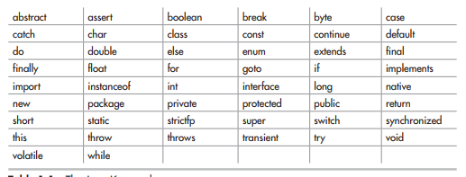

### **Các Từ Khóa Cơ Bản Trong Java & Ý Nghĩa **

Java không chỉ là một ngôn ngữ lập trình; nó còn là một thế giới riêng, nơi các **từ khóa (keywords)** đóng vai trò như nền tảng của thế giới. Nhưng đừng lo, nếu bạn mới bắt đầu và cảm thấy mơ hồ, tôi sẽ giúp bạn hiểu các từ khóa quan trọng trong Java một cách dễ nhớ và dễ hiểu. Hãy coi chúng như những “nhân vật chính” trong bộ phim lập trình này nhé!

---

### **1. `public`, `private`, `protected` – Ai Được Quyền Truy Cập?**

Ba từ khóa này giống như hệ thống cửa ra vào trong nhà bạn. Chúng quyết định ai được phép “vào” và “động chạm” đến dữ liệu hoặc phương thức của bạn:

- **`public`:** Mọi người đều được vào. Đây là kiểu "nhà không cần khóa" – bất cứ ai, bất kỳ đâu trong chương trình đều có thể truy cập.
- **`private`:** Chỉ chủ nhà mới được vào (bạn hoặc lớp của bạn). Dùng cái này để giấu "bí mật quốc gia" trong code.
- **`protected`:** Chỉ người thân, họ hàng (lớp con, lớp cùng package) mới được ghé thăm. Kiểu như “nhà có chìa khóa dự phòng cho họ hàng”.

---

### **2. `class` & `interface` – Khung Nhà và Hợp Đồng**

- **`class`:** Đây là bản thiết kế của mọi thứ trong Java. Bạn muốn tạo một siêu anh hùng? Hãy bắt đầu bằng `class`. Nó định nghĩa các thuộc tính (tóc, áo choàng) và hành động (bay, đấm đá).
- **`interface`:** Đây là hợp đồng. Bạn nói: "Tôi hứa sẽ làm điều này", nhưng cụ thể làm thế nào thì để sau hẵng tính. **`interface`** giúp định nghĩa các hành động mà lớp phải thực hiện.

Ví dụ: `class Superman` có thể bay và đấm. **`interface Flyable`** chỉ yêu cầu: “Nếu muốn bay, bạn phải viết rõ cách bay.”

---

### **3. `static` – Người Bạn “Không Thích Di Chuyển”**

- Khi bạn dùng từ khóa `static`, điều đó nghĩa là thứ này “ở yên một chỗ”, thuộc về **lớp** chứ không thuộc về đối tượng cụ thể. Nói cách khác, `static` giống như một bản đồ công cộng, ai cũng có thể dùng chung.

Ví dụ:
```java
public class Earth {
    static int population = 8000000000;
}
```
Dân số Trái Đất là của toàn cầu, không riêng gì một quốc gia, và `static` chính là cách bạn làm điều đó.

---

### **4. `void` – Làm Nhưng Không Nhận Công Lao**

- **`void`** giống như một người làm công việc thiện nguyện. Nó thực hiện nhiệm vụ (chạy chương trình) nhưng không trả lại bất kỳ kết quả nào.

Ví dụ:
```java
public void sayHello() {
    System.out.println("Hello, World!");
}
```
Hàm này nói “Hello”, nhưng đừng mong nó mang lại gì cho bạn (ngoài sự vui vẻ).

---

### **5. `if`, `else` – Người Phán Xét**

- Hai từ khóa này là thẩm phán trong chương trình của bạn. Chúng kiểm tra điều kiện và đưa ra quyết định:
    - **`if`:** "Nếu điều này đúng, tôi sẽ làm".
    - **`else`:** "Nếu không đúng, tôi làm cái khác".

Ví dụ:
```java
if (hungry) {
    eatPizza();
} else {
    drinkCoffee();
}
```
Nếu đói thì ăn pizza, nếu không thì làm cốc cà phê – rất logic và đời thường, đúng không?

---

### **6. `try`, `catch`, `finally` – Bộ Đội Xử Lý Lỗi**

- Đây là những người hùng cứu bạn khỏi việc chương trình “sập”. Khi có lỗi, **`try`** kiểm tra, **`catch`** bắt lỗi, và **`finally`** luôn đảm bảo dọn dẹp dù có chuyện gì xảy ra.

Ví dụ:
```java
try {
    int result = 10 / 0; // Ồ không, chia cho 0!
} catch (Exception e) {
    System.out.println("Có lỗi xảy ra: " + e.getMessage());
} finally {
    System.out.println("Dọn dẹp xong!");
}
```
Kết quả: Bạn không chết chìm trong lỗi chia 0, và vẫn sống sót để tiếp tục lập trình.

---

### **7. `new` – Đẻ Ra Những Thứ Mới**

- **`new`** là bà mụ trong thế giới Java. Khi bạn muốn tạo ra một đối tượng, bạn dùng `new`.

Ví dụ:
```java
Dog myDog = new Dog();
```
Bạn vừa sinh ra một chú chó (hoặc ít nhất là trong thế giới lập trình).

---

### **8. `final` – Cấm Chạm!**

- **`final`** giống như một quy tắc vàng: "Không được thay đổi". Dùng với biến, nó có nghĩa là giá trị của biến đó không bao giờ thay đổi. Dùng với lớp hoặc phương thức, nghĩa là chúng không được chỉnh sửa hoặc ghi đè.

---
Ngoài ra còn các nền tảng khác để xây dựng Java như hình

### **Kết Luận**

Các từ khóa trong Java giống như những công cụ xây nhà – mỗi từ có nhiệm vụ riêng. Ban đầu, bạn sẽ cảm thấy như đang học ngoại ngữ, nhưng yên tâm, chỉ cần vài lần thực hành, bạn sẽ dùng chúng “ngon lành” như một đầu bếp chuyên nghiệp.

Và nhớ: **Code Java giống như pha cà phê – cần kiên nhẫn, chú ý chi tiết, nhưng khi thành công, hậu vị sẽ rất ngọt ngào!** ☕